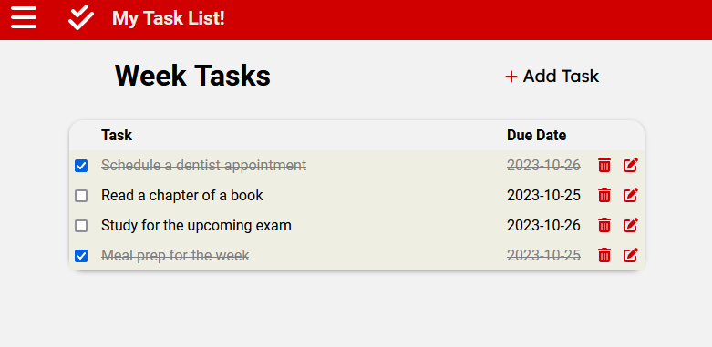

# Vue Todo-List



<a href="https://matalvarez10.github.io/vue-todolist/" style="font-size: 25px;">Ver Proyecto</a>

## Descripción

Este proyecto es una aplicación de lista de tareas pendientes (todo-list) hecha en Vue.js. La aplicación permite a los usuarios crear, marcar como completadas y eliminar tareas.

## Características

- Creación de tareas
- Marcado de tareas como completadas
- Eliminación de tareas
- Asociar tareas a proyectos especificos
- Filtrado de tareas por proyecto

## Requisitos

- Node.js 16+
- NPM 8+

## Instalación

- Clona el repositorio:

```sh
$  git clone https://github.com/matalvarez10/vue-todolist
```

- Instala las dependencias:

```sh
$  npm i
```

- Inicia el servidor de desarrollo:

```sh
$  npm run dev
```
